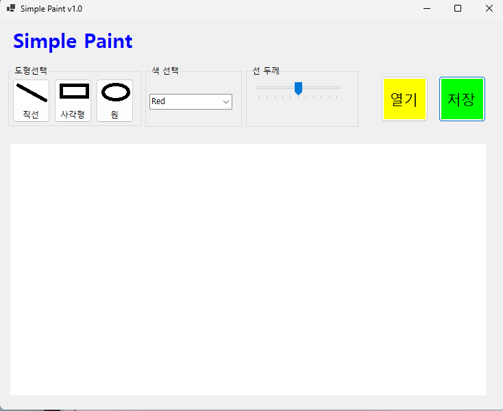
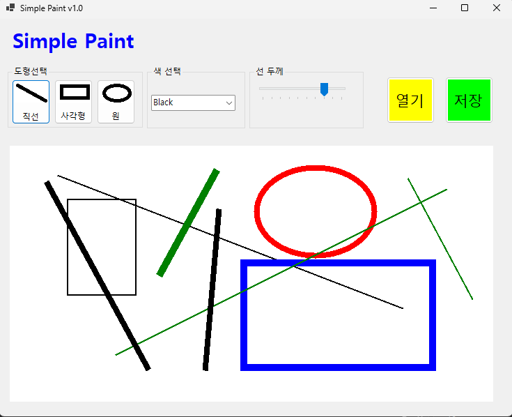
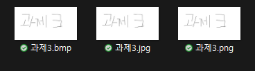

# (C# 코딩) 그림판 앱
## 개요
-C# 프로그래밍학습
-1줄소개: 윈도우의 그림판 앱을 간단하게 만들기
-사용한플랫폼: 
  -C#, .NET Windows Forms, Visual Studio, GitHub
-사용한컨트롤:
  PictureBox, ComboBox, TrackBar,Button,Label, GroupBox
-사용한기술과구현한기능:
  -Visual Studio를이용하여UI 디자인(pictureBox, comboBox, trackBar, button, label, groupBox 등)
  -마우스 이벤트를 이용하여 그림 그리기 기능 구현
  -case 문법을 이용하여 선 색 선택 기능 구현
  -선 드래그시 점선으로 표시하여 어떤 모양인지 미리 볼 수 있게 구현
  -선 굵기 조절 기능 구현
  -도형 그리기 기능 구현(직선, 사각형, 원형)
  -선 색 선택 기능 구현(검정, 초록, 빨강, 파랑)
  -선 기본 색상 설정 기능 구현(색 선택을 안 할 경우 기본색상인 검정색으로 그림 그리기)

  ## 실행화면(과제1)
  -코드의실행스크린샷과구현내용설명
  
  -구현한내용(위그림참조)
    -UI 구성: PictureBox, ComboBox, TrackBar,Button,Label, GroupBox
    -픽처박스: 그림판의 캔버스 역할을 한다
    -콤보박스: 선의 색상 선택(빨강, 초록, 파랑, 검정)을 가능하게 하는 버튼을 UI에 추가한다.
    -트랙바: 선의 굵기 조절( 1~10 까지 선택 가능 )을 가능하게 하는 버튼을 UI 에추가한다.
    -버튼: 선의 스타일 선택( 직선, 사각형, 원형 )을 가능하게 하는 버튼을 Ui에 추가하고 파일선택 버튼, 파일저장 버튼을 UI에 추가한다
    -그룹박스: 선 스타일 옵션 그룹화 하여 사용자 인터페이스를 깔끔하게 구성한다.

   ## 실행화면(과제2)
  -코드의실행스크린샷과구현내용설명
  
   -구현한내용(위그림참조)
    -마우스 드래그를 이용한 그림 그리기 기능 구현
    -직선 버튼 클릭시 직선으로 그림 그리기 기능 구현
    -사각형 버튼 클릭시 사각형으로 그림 그리기 기능 구현
    -원형 버튼 클릭시 원형으로 그림 그리기 기능 구현
    -색 선택 콤보박스에서 선택한 색상(검정,초록,빨강,파랑) 으로 그림 그리기 기능 구현
    -색 선택을 안 할 경우 기본색상인 검정색으로 그림 그리기 기능 구현
    -선 굵기 조절 트랙바에서 선택한 굵기로 그림 그리기 기능 구현
    -이벤트를 손수 손코딩하여 작성, case 문법을 이용하여 선 색 선택을 하는 경우를 나눠서 구현
    -선 드래그시 점선으로 표시하여 어떤 모양인지 미리 볼 수 있게 구현

   ## 실행화면(과제3)
  -코드의실행스크린샷과구현내용설명
  
  -구현한내용(위그림참조)
   -그려진 그림을 이미지 파일로 저장하는 기능 구현
   -파일 저장 기능 구현: 사용자가 그린 그림을 파일로 저장할 수 있는 기능을 구현한다. (예: PNG, JPG, BMP 형식)
   -파일 저장을 위한 대화상자인 SaveFileDialog 사용
   -파일 저장 완료시 사용자에게 저장 성공 메시지 표시
   -파일 저장 실패시 사용자에게 오류 메시지 표시 
